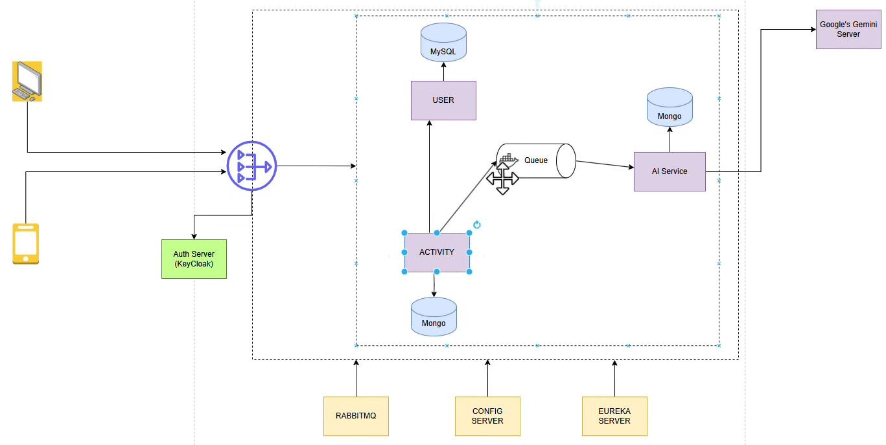

# FitSync AI

## Microservices-Based Fitness Application with Spring Boot + React

Welcome to the comprehensive microservices-based fitness application project! This repository contains a complete, production-ready fitness platform built on a modern microservices architecture using Spring Boot and React.



## 🚀 Highlights

- **Full-Featured Fitness Application** built on a scalable microservices architecture
- **Advanced AI Integration** leveraging Google Gemini API for personalized fitness experiences
- **Step-by-step implementation guide** perfect for learning microservices patterns
- **Production-ready codebase** with complete authentication, monitoring, and scaling

## 🛠️ Tech Stack

### Backend

- **Spring Boot** - Java-based microservices framework
- **Spring Cloud Netflix (Eureka Server)** - Service discovery and registration
- **Spring Cloud Gateway** - API gateway for routing and load balancing
- **Keycloak** - Identity and access management
- **RabbitMQ (Spring AMQP)** - Message broker for inter-service communication
- **PostgreSQL / MySQL** - Relational database options
- **Google Gemini API** - AI capabilities for workout recommendations and analysis
- **Spring Cloud Config Server** - Centralized configuration management

### Frontend

- **React** - UI library for building the user interface
- **Redux** - State management
- **Material UI** - Component library
- **React Router** - Navigation and routing

## 🏗️ Architecture Overview

The application follows a microservices architecture with the following key components:

1. **API Gateway** - Entry point for client requests, handles routing and authentication
2. **Service Discovery (Eureka)** - Registers and locates service instances
3. **Config Server** - Centralizes configuration across services
4. **Auth Service** - Manages user authentication and authorization with Keycloak
5. **User Service** - Handles user profiles and settings
6. **Workout Service** - Manages workout plans and exercises
7. **Progress Service** - Tracks user fitness progress
8. **AI Service** - Integrates with Google Gemini API for personalized recommendations
9. **Notification Service** - Manages user notifications and reminders

## 🚦 Getting Started

### Prerequisites

- Java 17+
- Node.js 18+
- Docker and Docker Compose
- Maven or Gradle

### Setup and Installation

1. **Clone the repository**

   ```bash
   git clone https://github.com/yourusername/fitsync-ai.git
   cd fitsync-ai
   ```

2. **Start the infrastructure services with Docker Compose**

   ```bash
   docker-compose up -d
   ```

   This will start PostgreSQL, RabbitMQ, Keycloak, and other dependencies.

3. **Start the Config Server and Eureka Server**

   ```bash
   cd config-server
   ./mvnw spring-boot:run

   # In a new terminal
   cd eureka-server
   ./mvnw spring-boot:run
   ```

4. **Start the microservices**

   ```bash
   # Start each in a separate terminal
   cd api-gateway
   ./mvnw spring-boot:run

   cd auth-service
   ./mvnw spring-boot:run

   # Continue for other services...
   ```

5. **Start the React frontend**

   ```bash
   cd frontend
   npm install
   npm start
   ```

6. **Access the application**
   - Frontend: http://localhost:3000
   - Eureka Dashboard: http://localhost:8761
   - API Gateway: http://localhost:8080
   - Keycloak Admin: http://localhost:8090

## 📚 Documentation

- [Architecture Documentation](./docs/architecture.md)
- [API Documentation](./docs/api.md)
- [Deployment Guide](./docs/deployment.md)
- [AI Integration Guide](./docs/ai-integration.md)

## 🧪 Testing

The project includes comprehensive testing at multiple levels:

```bash
# Run unit tests
./mvnw test

# Run integration tests
./mvnw verify -P integration-tests

# Run end-to-end tests
cd e2e-tests
npm test
```

## 🚢 Deployment

The application is designed for easy deployment to Kubernetes or any cloud platform:

- [Kubernetes Deployment Guide](./docs/kubernetes.md)
- [AWS Deployment Guide](./docs/aws-deployment.md)
- [Azure Deployment Guide](./docs/azure-deployment.md)

## 📊 Monitoring and Observability

The application includes:

- Prometheus for metrics collection
- Grafana for visualization
- Distributed tracing with Spring Cloud Sleuth and Zipkin
- Centralized logging with ELK Stack

## 🤝 Contributing

Contributions are welcome! Please check out our [Contribution Guidelines](./CONTRIBUTING.md).

## 📜 License

This project is licensed under the MIT License - see the [LICENSE](./LICENSE) file for details.

## 🙏 Acknowledgements

- [Spring Boot](https://spring.io/projects/spring-boot)
- [Spring Cloud](https://spring.io/projects/spring-cloud)
- [React](https://reactjs.org/)
- [Google Gemini API](https://cloud.google.com/gemini)
- All other open-source libraries used in this project
